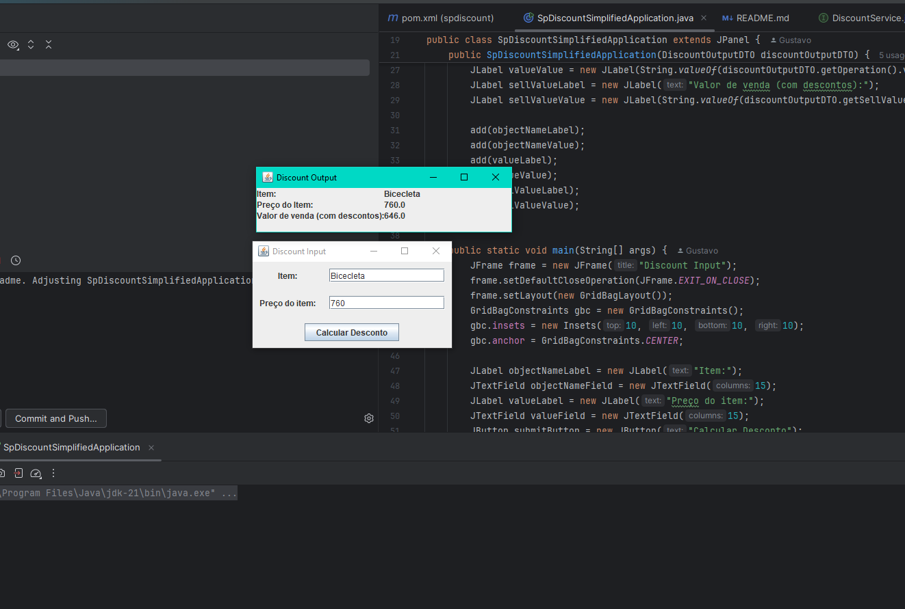

# SpDiscountSimplifiedApplication

## Descrição

A **SpDiscountSimplifiedApplication** é uma aplicação Java que permite ao usuário inserir o nome de um objeto e seu valor, e então calcula o valor de venda com desconto. A aplicação exibe o nome do objeto, seu valor e o valor de venda com desconto utilizando uma interface gráfica Swing.

## Funcionalidades

- Inserção do nome do objeto e seu valor.
- Cálculo do valor de venda com desconto.
- Exibição do nome do objeto, valor original e valor de venda com desconto.

## Tecnologias Utilizadas

- Java
- Swing para a interface gráfica
- Maven para gerenciamento de dependências

## Estrutura do Projeto

- `src/main/java/com/spdiscount/spdiscount/SpDiscountSimplifiedApplication.java`: Classe principal da aplicação.
- `src/main/java/com/spdiscount/spdiscount/dtos/DiscountOutputDTO.java`: Classe DTO para a saída do desconto.
- `src/main/java/com/spdiscount/spdiscount/services/DiscountService.java`: Interface do serviço de desconto.
- `src/main/java/com/spdiscount/spdiscount/services/impl/DiscountServiceImpl.java`: Implementação do serviço de desconto.

## Como Executar

1. Clone o repositório:
    ```sh
    git clone https://github.com/seu-usuario/spdiscount-simplified.git
    cd spdiscount-simplified
    ```

2. Compile o projeto usando Maven:
    ```sh
    mvn clean install
    ```

3. Execute a aplicação:
    ```sh
    mvn exec:java -Dexec.mainClass="com.spdiscount.spdiscount.SpDiscountSimplifiedApplication"
    ```

## Exemplo de Uso

1. Ao executar a aplicação, uma janela será aberta solicitando o nome do objeto e seu valor.
2. Insira o nome do objeto e o valor.
3. A aplicação calculará o valor de venda com desconto e exibirá os resultados na interface gráfica.



## Autor

- Gustavo Toledo